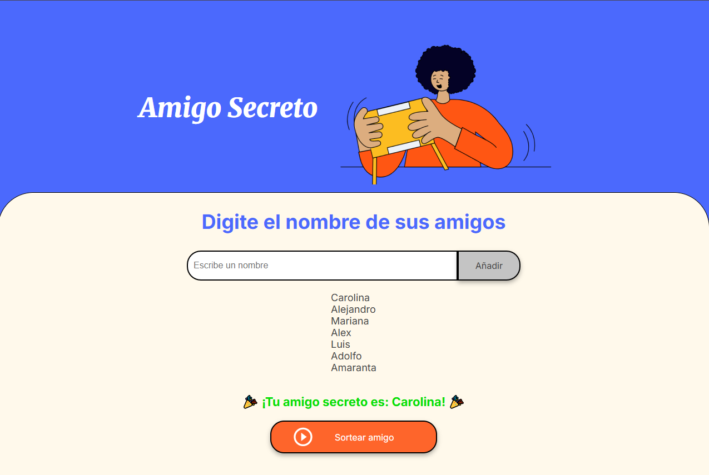

# 🎯 Sorteo de Amigos

 <!-- Opcional, puedes cambiar la ruta -->

## 📌 Índice
- [Descripción](#descripción)
- [Estado del Proyecto](#estado-del-proyecto)
- [Funcionalidades](#funcionalidades)
- [Demostración](#demostración)
- [Acceso al Proyecto](#acceso-al-proyecto)
- [Tecnologías Utilizadas](#tecnologías-utilizadas)
- [Autor](#autor)
- [Licencia](#licencia)

## 📖 Descripción
Este proyecto permite **gestionar una lista de amigos** y realizar un **sorteo aleatorio** para elegir uno.  
Está desarrollado con HTML, CSS y JavaScript, siguiendo buenas prácticas de manipulación del DOM.

## 🚧 Estado del Proyecto
✅ Proyecto funcional con opciones de mejora.

## ✨ Funcionalidades
- Agregar amigos a la lista
- Mostrar la lista en pantalla
- Limpiar la lista antes de cada actualización
- Seleccionar un amigo al azar sin repeticiones hasta completar todos

## 📸 Demostración

## 🔗 Acceso al Proyecto
[Ver repositorio en GitHub](https://github.com/KaruvaStudio/challenge-amigo-secreto.git)

## 🛠️ Tecnologías Utilizadas
- HTML5
- CSS3
- JavaScript (ES6+)

## 👩‍💻 Autor
Carolina Castrillón Esparza 
[LinkedIn](https://www.linkedin.com/in/carolinacastrillon/) | [GitHub](https://github.com/KaruvaStudio)

## 📄 Licencia
Este proyecto no está bajo la Licencia. 
